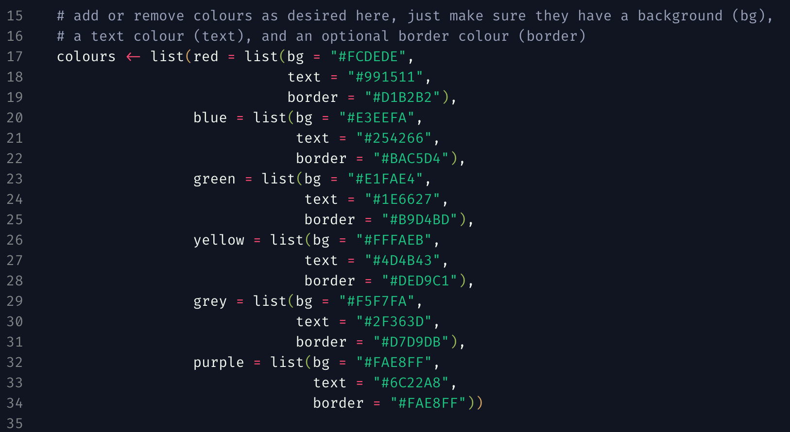
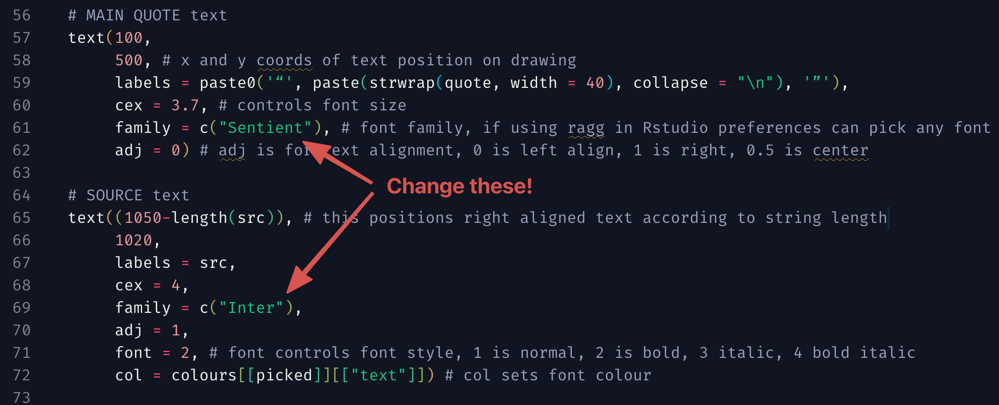

# Instagram Quote Images Generator

This is an [R](https://www.r-project.org/) script to generate pretty [Instagram](https://www.instagram.com/) quote images from a list of quotes stored in a tab-delimited `.tsv` file, with a splash of random colouring.

**Example:**

## Usage

1. Install [R](https://www.r-project.org/) and [Rstudio](https://www.rstudio.com/).
2. Update `quotes.tsv` with your own list of quotes and sources. Be careful that each line has it's own unique `id`, as this will produce the final output file name for that quote. I've used numbers, but you can use anything you like. Use a single `tab` press to separate columns - this is used instead of `csv` so that commas can be easily included in the quote.
3. Make sure you have the [renv](https://rstudio.github.io/renv/) and [ragg](https://ragg.r-lib.org/) packages installed in R, as well as the free fonts [Inter](https://fonts.google.com/specimen/Inter) and [Sentient](https://www.fontshare.com/fonts/sentient) if you'd like things to look exactly the same as my examples. Then, in Rstudio, set [ragg as the graphics back-end](https://ragg.r-lib.org/#use-ragg-in-rstudio).
4. From the project directory, run `renv::init()` to download and install the required packages to the project directory (this will not affect your main R libraries). Or, install them manually: [magick](https://docs.ropensci.org/magick/), [purrr](https://purrr.tidyverse.org/), and [readr](https://readr.tidyverse.org/).
5. From the project directory, run `generator.R` to generate the images in an `out` directory from `quotes.tsv`. This can be done from within Rstudio at the R console with `source('generator.R')`, or from any terminal with `Rscript 'generator.R'`.

## Customising colours

In `generator.R`, you will find a named list of colour options that you can change to whatever you like - just make sure each has a name at the top level (`red`, `blue`, `green` etc) and has a `bg`, `text` and `border` value associated. The values included by default are taken from [the alert box colours](https://github.com/tajmone/pandoc-goodies/blob/master/templates/html5/github/src/_alerts.scss) used in [Tristano Ajmone's](https://github.com/tajmone) [Pandoc Goodies](https://github.com/tajmone/pandoc-goodies) repo, 

## Customising fonts

In `generator.R`, you can also customise the fonts used by changing the `family` argument to each `text` block. If using [ragg](https://ragg.r-lib.org/), you can use any font you have installed on your system.

Other options you can change are also annotated as comments in the code, such as text alignment and font style.

## Non-random colours

If you'd like to set the colours yourself rather than randomly picking from the colours list, the quickest way I would suggest is to add another column titled `picked` to the end of `quotes.tsv` with the colour label you want to choose for each quote as a string (e.g. `red`).

Then, in the function `create_image` on line 11, add another argument called `picked` so the whole function call becomes `create_image <- function(id, quote, src, picked)`.

Finally, comment out or delete line 37, `picked <- sample(names(colours), 1)`, and run the script.